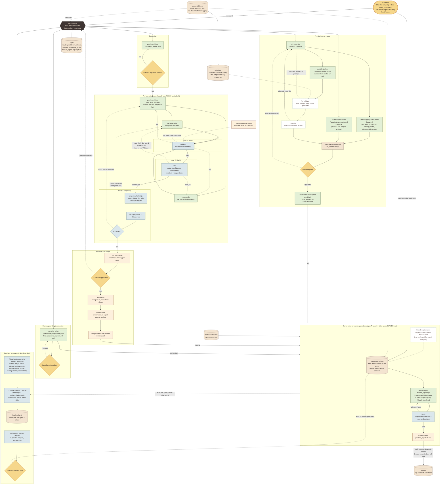

```mermaid
flowchart TD
    %% Let's Eat! multi-agent orchestration, updated 2026-11-24
    %% Green = generators, blue = evaluators, yellow = Gabriella, dashed red = refine (route back), grey dashed = planned

    G(["Gabriella<br/>Plan the campaign / Build level_XX / Status<br/>run feature agent / run bug hunt / picks"])
    O{{"Orchestrator<br/>runs the crew, routes failures, logs every step"}}
    BIBLE[("game_bible.md<br/>single source of truth<br/>incl. Sound effects mapping")]
    RULES[("rules.json<br/>bible as checkable config<br/>incl. art.palette Cozy Ramps 32")]

    G -->|command| O
    BIBLE --> RULES
    BIBLE -.->|read first| O

    subgraph PLAN["Campaign"]
        PA0["puzzle-architect<br/>campaign_outline.json"]
        AP0{"Gabriella approves outline?"}
        PA0 --> AP0
    end
    O --> PA0
    AP0 -->|no| PA0

    subgraph LEVEL["Per-level pipeline on branch level/XX (20 levels built)"]
        direction TB
        PA["puzzle-architect<br/>spec_level_XX.json<br/>answer, decoys, why each fails"]
        NW["narrative-writer<br/>dialogue + outcomes"]
        MS["map-seeder<br/>venues + district registry"]
        PA --> NW
        PA --> MS

        subgraph L1["Loop 1: Rules"]
            VAL["Validator<br/>node scripts/validate.js"]
        end
        subgraph L2["Loop 2: Quality"]
            CR["critic<br/>voice, clue fairness, consistency<br/>must_fix + suggestions"]
        end
        subgraph L3["Loop 3: Playability"]
            PP["prepare_playtest.js<br/>player-visible files only,<br/>clue tags stripped"]
            BP["blind-playtester x3<br/>3 fresh runs"]
            JUDGE{"3/3 correct?"}
            PP --> BP --> JUDGE
        end

        NW --> VAL
        MS --> VAL
        VAL -->|pass| CR
        CR -->|no must_fix| PP
    end
    AP0 -->|yes| PA
    RULES --> VAL

    VAL -. "fail: back to the file's writer" .-> NW
    VAL -. fail .-> MS
    VAL -. fail .-> PA
    CR -. "must_fix (+ 1st-round suggestions)<br/>then re-run Validator" .-> NW
    CR -. must_fix .-> MS
    JUDGE -. "2/3 or clue buried:<br/>strengthen clue" .-> NW
    JUDGE -. "0-1/3, puzzle unsound" .-> PA

    CAP["Max 3 retries per agent<br/>then flag level for Gabriella"]
    CAP -.- VAL

    subgraph SHIP["Approval and merge"]
        PR["PR into master<br/>one-line summary per check"]
        AP{"Gabriella approves?"}
        INT["Integration<br/>integrate.js, cross-level check"]
        PROV["Provenance<br/>provenance.js, agent commit hashes"]
        MERGE["Merge commit into master<br/>never squash"]
        PR --> AP -->|yes| INT --> PROV --> MERGE
    end
    JUDGE -->|yes| PR
    AP -. "changes requested" .-> O

    subgraph ENDC["Campaign ending (on master)"]
        NWE["narrative-writer<br/>content/campaign/ending.json<br/>final group chat, caption, roll call"]
        APE{"Gabriella reviews lines"}
        NWE --> APE
    end
    O --> NWE
    APE -. "changes" .-> NWE

    subgraph ART["Art pipeline on master"]
        AG["art-generator<br/>prompts in palette"]
        PXL["pixellab_draft.py<br/>badges + cuisine icons<br/>pauses when credits run out"]
        GEM["Gemini app by hand (Nano Banana 2)<br/>outcomes, scrapbook, ending photos,<br/>city map, title screen"]
        SCR["Screen layout drafts<br/>Playwright screenshots of the game<br/>(map M1-M7, badges, ending)"]
        DASH["Art Artifacts dashboard<br/>art_dashboard.py"]
        AVAL["Art validator<br/>size, transparency, name, palette fit"]
        ACR["Art critic<br/>cozy, soft outlines, no text"]
        PICK{"Gabriella picks"}
        AA["art-asset + import picks<br/>assets/art, slice_portraits.py,<br/>asset manifest"]
        AG --> PXL --> AVAL
        AG --> GEM --> DASH
        SCR --> DASH
        AVAL --> ACR --> DASH --> PICK
        PICK -->|approved| AA
    end
    O --> AG
    O --> SCR
    RULES -.-> AVAL
    PICK -. "rejected keys + why" .-> AG
    AVAL -. "planned: fail back to prompts" .-> AG
    ACR -. "planned: must_fix" .-> AG

    subgraph GAME["Game build on branch game/prototype (Phaser 3 + Vite, game/CLAUDE.md)"]
        direction TB
        REQ[("requirements.json<br/>what the bible asks of the game<br/>status, impact, effort, depends")]
        FA["feature agent<br/>feature_agent.mjs<br/>1. gap scan (detect rules)<br/>2. build top-priority gap (Claude headless)"]
        BOOT["Verify<br/>requirement detected +<br/>npm run boot-test"]
        GC["Game commit<br/>[feature_agent] id: title"]
        REQ --> FA --> BOOT
        BOOT -->|pass| GC
        BOOT -. "fail: retry / stop" .-> FA
        GATE["Gated requirements<br/>depends on an id that doesn't exist<br/>(e.g. ending add-ons wait for a pick)"]
        GATE -.- REQ
    end
    G -->|"add to requirements.json"| REQ
    BIBLE -.-> REQ
    MERGE -->|content| GAME
    NWE -->|ending lines| GAME
    AA -->|art| GAME
    SFX[("assets/sfx + music<br/>sync_assets.mjs")] --> GAME
    GC -->|"push game prototype to master<br/>(merge commit), then pull back"| MASTER[("master<br/>tag final-draft = c6fb8ea")]

    subgraph BUG["Bug hunt (on request, after final-draft)"]
        direction TB
        BH["7 bug-hunter agents in parallel, own ports<br/>normal-player, speed-clicker, keyboard-only,<br/>settings-fiddler, quitter, wrong-answer, accessibility"]
        PW["Drive the game in Chrome<br/>Playwright + bughunt_helpers.mjs<br/>screenshots, errors, saved data"]
        BR[("logs/bughunt/<br/>one report per agent + shots")]
        TRI["Orchestrator merges reports<br/>duplicates merged, blockers first"]
        FIX{"Gabriella decides fixes"}
        BH --> PW --> BR --> TRI --> FIX
    end
    O --> BH
    GAME -.->|"tests the game, never changes it"| PW
    FIX -. "fixes as new requirements" .-> REQ

    LOG[("logs/<br/>run_log, validation, critique,<br/>playtest, integration_audit,<br/>feature_agent.log, bughunt")]
    O --- LOG

    classDef gen fill:#e3f0d6,stroke:#46603a,color:#2e2624
    classDef eval fill:#dbe7ec,stroke:#385e73,color:#2e2624
    classDef human fill:#f6d78b,stroke:#b8641a,color:#2e2624
    classDef store fill:#f3e4d0,stroke:#7d6a60,color:#2e2624
    classDef orch fill:#3f3533,stroke:#2e2624,color:#fdf0dc
    classDef planned fill:#ffffff,stroke:#9fb6bf,stroke-dasharray:5 5,color:#5a4a45
    classDef ship fill:#fdf0dc,stroke:#8a4a2c,color:#2e2624

    class PA0,PA,NW,MS,AG,AA,PXL,GEM,SCR,NWE,FA gen
    class VAL,CR,PP,BP,JUDGE,BOOT,BH,PW,TRI eval
    class G,AP0,AP,PICK,APE,FIX human
    class BIBLE,RULES,LOG,DASH,REQ,SFX,BR,MASTER store
    class O orch
    class AVAL,ACR,GATE planned
    class PR,INT,PROV,MERGE,CAP,GC ship
```